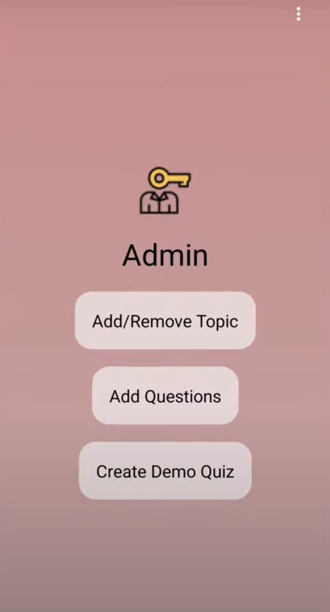
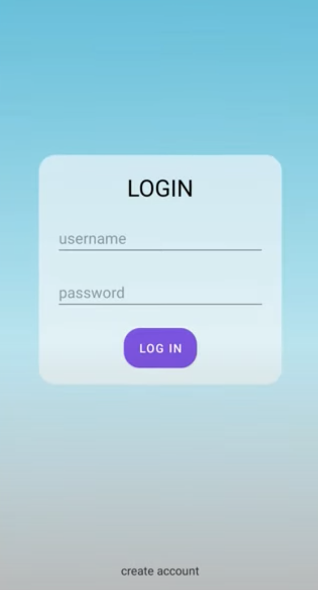

###  
 Questioner Quiz App 

#### Fetures

- Cleaner interface
- Demo Topic Creation
- the admin can see user with quiz and score achived
- Works Offline
- Add/Remove Topic
- Time Limit for Questions
- Clean and Simple Coding
- Add/Remove Questions
- Local Account Creation
- Animations for wrong and correct option selection

#### Prerequisites :
- Android Studio
- Basic knowledge about android app developing.

#### How to Build this Project?
- Clone this project or Download Zip.
- Extract it and Open the Project in Android Studio.
- Wait to download required files.
- Build App..
- Install and Open.
- Login using Admin's credentials (Username - admin | Password - admin).
- Click on Create Demo Quiz button for testing.
- Click top right dots and logout.
- Create account and login using new created account.

